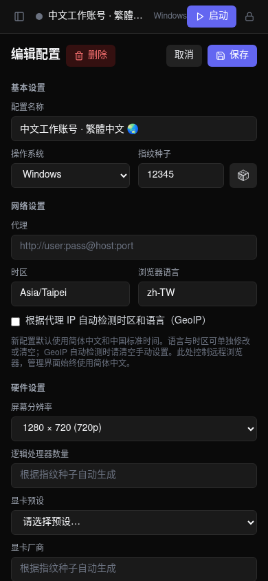
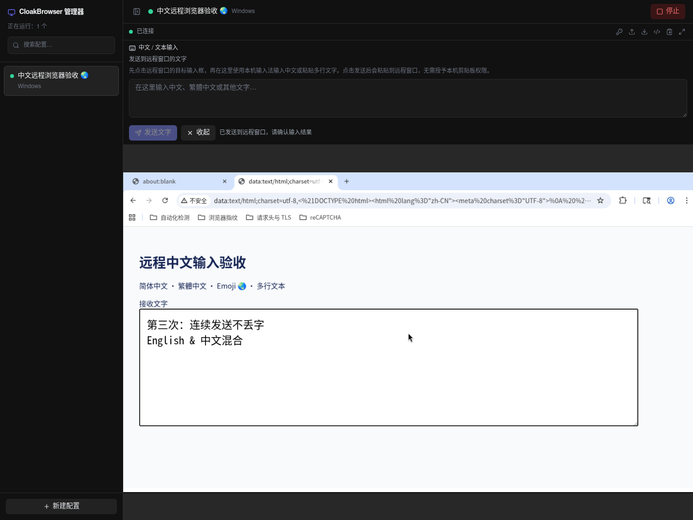
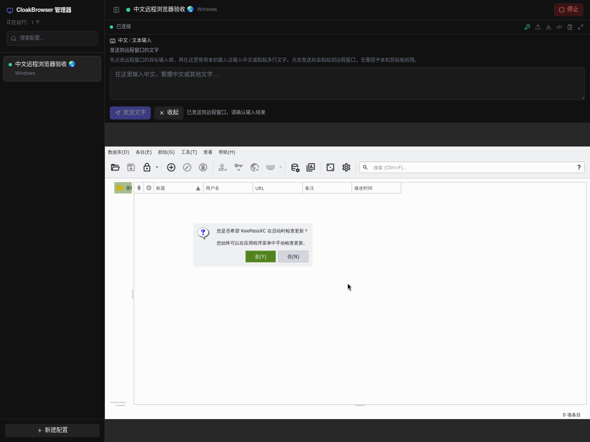

# 中文版验收记录

验收日期：2026-09-17。版本：`0.1.0-zh.1`，基于 CwithW `2d6ab81`。

## 自动化检查

| 检查 | 结果 |
| --- | --- |
| 后端 pytest | 200 项通过（包含真实 SQLite / HTTP 中文读写，以及模拟浏览器生命周期） |
| 前端 Vitest | 37 项通过（包含中文错误、输入法组合事件、Unicode 传输与粘贴顺序） |
| TypeScript + Vite 生产构建 | 通过 |
| `bash -n entrypoint.sh` | 通过 |
| `docker compose config --quiet` | 通过 |
| `git diff --check` | 通过 |
| 前端依赖 `npm audit` | 锁定依赖检查为 0 个已知漏洞 |
| Docker amd64 镜像构建 | 通过 |

后端测试环境：Python 3.13；容器运行时为 Python 3.12。前端本地验证使用 Node.js 24，CI 使用 Node.js 22。依赖沿用上游版本范围，本次容器实际安装 CloakBrowser Python 包 `0.5.10`；真实浏览器使用其自动下载的免费 Chromium 146。

## 浏览器界面检查

`scripts/check_chinese_ui.py` 使用真实 Chromium 渲染界面，API 使用内存模拟数据；此项检查不会启动远程 CloakBrowser。

已验证中文登录错误、创建、编辑、保存、名称搜索、删除确认、简繁中文与 Emoji 数据、保留已有语言/时区设置，以及 1440 像素桌面与 390 像素手机布局。页面无脚本错误，手机页面无横向溢出。

```bash
# 终端一
cd frontend
npm run build
npm run preview -- --host 127.0.0.1 --port 18080

# 终端二，在仓库根目录执行
# 如未安装 Playwright 浏览器，先运行 .venv/bin/playwright install chromium
.venv/bin/python scripts/check_chinese_ui.py
# 也可通过 CHROMIUM_PATH 指定已安装的 Chromium 可执行文件。
```




## 真实容器与中文输入

`scripts/check_chinese_container.py` 创建仅监听 localhost 的临时容器，以 tmpfs 保存测试数据，结束时停止并移除容器。此检查启动真实 CloakBrowser、KasmVNC 与 KeePassXC，使用本地测试页面，不登录任何第三方账号。

已验证：

- 管理器健康检查、真实浏览器与 KeePassXC 启动、VNC 连接。
- 通过 CDP 读取到 `navigator.language = zh-CN`，`navigator.languages = [zh-CN]`，时区为 `Asia/Shanghai`。
- 通过中文输入面板连续发送 3 组简繁中文、Emoji、标点和换行，远程网页文本框收到的内容逐字一致；剪贴板接口读回也一致。
- KeePassXC 与 Chromium 窗口双向切换、浏览器停止以及无页面脚本错误。
- 容器字符集为 UTF-8，Fontconfig 可为简体与繁体中文找到 Noto CJK 字体。
- KeePassXC 应用文案与 Qt 标准按钮加载中文翻译。

```bash
docker build -t cloakbrowser-manager:zh-local .
.venv/bin/python scripts/check_chinese_container.py
```





## KeePassXC 兼容性复测

初次验证时，在 `zh_CN.UTF-8` 进程环境下观察到 KeePassXC AppImage 偶发以 `-11` 退出。当前实现将 KeePassXC 子进程设为 `C.UTF-8`，同时通过其 `GUI/Language=zh_CN` 配置加载中文界面；浏览器语言和容器中文字体保持独立。

AppImage 自带的目录缺少 `qtbase_zh_CN.qm`，导致「是 / 否」等 Qt 标准按钮显示英文。构建时从 Debian `qttranslations5-l10n` 提取完整语言包和版权说明，放入 KeePassXC 的翻译目录，不替换其 Qt 运行库。加载路径依据 [KeePassXC 2.7.12 Translator.cpp](https://github.com/keepassxreboot/keepassxc/blob/2.7.12/src/core/Translator.cpp)。

调整后在两种容器全局语言环境下各连续创建 4 个新配置：8 次真实启动、16 次窗口切换全部通过，未复现退出。结果保存在 [生命周期结果](verification-data/keepassxc-lifecycle.json)。这是有限次数的本地兼容性验证，不代表对第三方运行时的稳定性保证。

```bash
.venv/bin/python scripts/check_keepassxc_lifecycle.py
```

上述检查不验证外部网站的反自动化判定、第三方账号登录或通行密钥注册流程。
